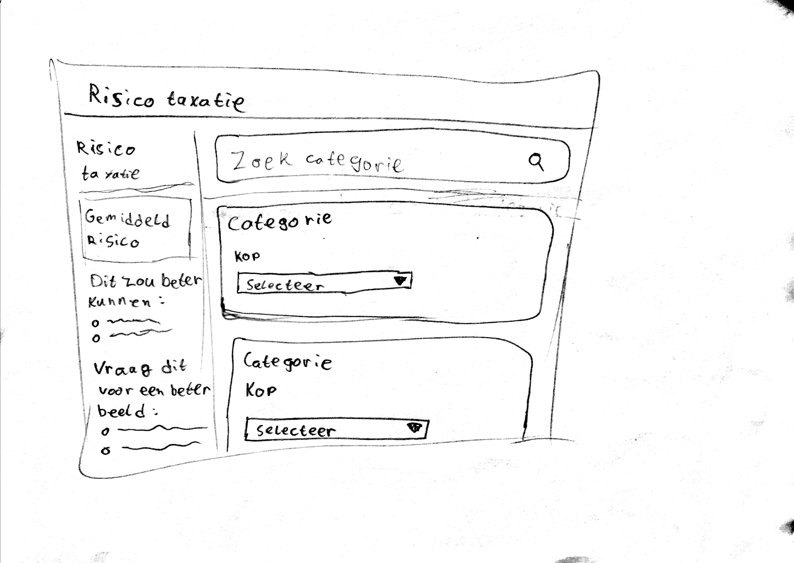

# 📓 Proces
Tekst over het proces

## Inhoud
* [Framework](#framework)
* [Concept](#concept)
* [Ontwikkeling](#ontwikkeling)

## 🖼️ Framework
Als framwork heb ik mijn derde keus, [ember.js](https://www.emberjs.com/), toegewezen gekregen. Die hele dag heb ik besteed aan installeren van ember-cli. Dit bleek namelijk veel ingewikkelder dan gehoopt. Bij het lokaal en global installeren werden verschillende errors gegooid. Toen ik naar huis ging was het nog steeds niet gelukt.
Het is Roene die avond gelukt om ember te installeren na het uitvoeren van de volgende commands:
```
npm config set user 0
npm config set unsafe-perm true
```
Ik heb de volgende dag mijn laptop meegenomen naar mijn werk en de bovenstaande commands uitgevoerd en geprobeerd ember global te installeren. Dit leverde nog steeds errors op omdat npm niet kon schrijven in de .nvm directory. Toen heb ik `chmod 777` uitgevoerd in het .nvm mapje. Dit zorgt ervoor dat het mapje en alles er in kan worden gezelen en geschreven.
Toen ik de volgende dag op school kwam werd mij door de anderen die ember hadden aangeraden om de tutorial te gaan maken. Dit leek me een goed idee om een de basis van wat ember kan een beetje te verkennen.

## 💡 Concept
Ik had al een concept in mijn hoofd. Daar heb ik na het maken van de tutorial een schets van gemaakt.

<!-- Vul concept aan met meer info -->

## 🛠️ Ontwikkeling
Ik heb als eerst de statische structuur van mijn concept uitgewerkt en de basisconfiguratie van ember gedaan. Dit was vrij makkelijk omdat ember-cli command heeft om routes, componenten, helpers e.t.c. aan te maken. Je hoeft daarvoor dus zelf niks in te stellen wat er voor zorgt dat je je alleen hoeft te focussen op het maken van je applicatie.
Bijvoorbeeld: `ember new ember projectNaam` maakt een nieuwe map `projectNaam` aan met daarin een voorgeconfigureerd ember project. `ember new route about` zorgt er voor dat er een nieuwe route en pagina worden aangemaakt voor een about pagina. `ember serve` of `ember s` voor de luie mensen zorgt er dan voor dat je applicatie wordt gehost op localhost:4200.  

### Data inladen
Na het maken van de basis wilde ik de data in gaan laden in het format van mijn concept. Hiervoor moest de data vanuit het JSON bestand omgezet worden naar een bruikbaar format. Een deel daarvan had Martijn al gedaan. Zijn code heb ik dan ook gebruikt. Wel wilde ik de data per categorie inladen dus moest ik de data nog weer in een ander format gieten. Dit was het eerste probleem waar ik tegen aan liep.
Ik heb het uiteindelijk opgelost met een switch die 21 cases bevat. Het is best wel een lelijke oplossing, maar het werkt en omdat er niet veel tijd was heb ik dat ook zo gelaten.

### Risico berekenen
Nadat de data was ingeladen ben ik begonnen met het berekenen van het risico op een uithuisplaatsing. Hiervoor heb ik een component aangemaakt. Ik heb het gewicht van van een antwoord in het `<option>` element van de bijbehorende `<select>` gestopt. Vervolgens heb ik `querySelectorAll('select').value` gebruikt om alle geselecteerde gewichten te krijgen, die vervolgens bij elkaar op te tellen en te gebruiken in de formule om het risico te berekenen.

### LocalStorage
Toen was het zo ver om te zorgen dat de geselecteerde opties geselecteerd bleven als de pagina werd herladen. LocalStorage zelf was vrij makkelijk. Het verkrijgen van de juiste informatie uit de `<select>` en `<option>` elementen was veel moeilijker. Hier heb ik heel lang op vastgezeten. 
Ik had eerst alle values opgehaald uit de `<select>` dropdowns als ze een waarde hadden (dus geen placeholder). Alleen het terugzetten van die values bleek niet goed mogelijk te zijn.
Daniël zat met het zelfde probleem maar probeerde het met `event.target`. Dat leek beter te werken dus ik heb mijn code toen verwijderd en ben opnieuw begonnen. Daarin zitten onder anderen de index van het geselecteerde `<option>` element en het id van de `<select>`. Die heb ik vervolgens in een object met array's gestopt om vervolgens dat object op te slaan in localStorage en het bij het veranderen van een `<select>` dropdown weer op te halen en te updaten.
Het opslaan werkte allemaal prima, alleen het update (en dus overschrijven) van een value lukte niet helemaal. Er werd telkens een item toegevoegd i.p.v. geüpdated. Het duurde vrij lang voordat ik dat probleem had opgelost. Uiteindelijk lukte het met een relatief simpel en niet zo groot stukje code. Het opslaan van de jusite values werkte dus.

### Reset formulier
Voor de reset formulier knop heb ik een nieuw component gemaakt met daaraan hangend een action die localStorage leeg maakt en de `.selectedIndex` weer 0 maakt (de placeholder). 

### Opnieuw inladen
Toen was moesten de values opnieuw ingeladen worden. Dit heb ik gedaan door een IIFE te maken die eerst kijkt of localStorage data bevat; als dat zo is wordt er in een loop een var aangemaakt met het id van een `<select>` element. Op dat var element wordt dan de `.selectedIndex` gezet op de vorige opgeslagen waarde. 

### Opnieuw berekenen
Als laatst moet het risico nog berekend worden. Die berekening heb ik toegevoegd aan het component dat de data ook in localSotrage opslaat. Toen de berekening werkte heb ik het uiteindelijke risico ook toegevoegd aan localStorage en gezorgd dat deze na het herladen van een pagina opnieuw ingeladen werd.

## Terug🥫
Ik vond het werken met een framework best lastig omdat er maar zo kort de tijd was om het een beetje goed te leren. Ik heb daarom bijvoorbeeld niet de data module van ember gebruikt, of de zoekfunctie werkend gemaakt.
Wel vond ik het erg makkelijk dat je met ember-cli commands als `ember generate route about` kan gebruiken om routes/componenten/helpers e.t.c. aan te maken, zodat ik me kon focussen op het bouwen van mijn applicatie.
